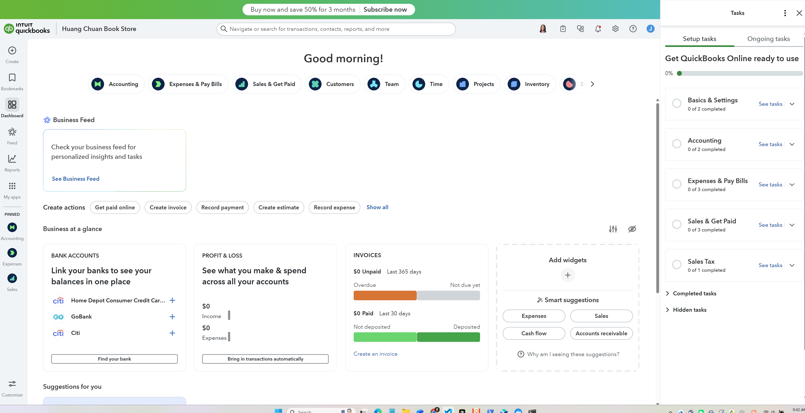

# Quickbooks Online

## 注册新账号

### 基本信息采集

这里有三个分流，我们按顺序看：

### invoice设置

invoice个性化设置

这里要注意这里的invoice指的是customer invoice，也就是收款发票；付款在QBO中叫做bill, vendor invoice以及支付款项的receipes。

这里要开通线上收款功能，可以让收到invoice的商家直接支付，同时quickbooks也可以记录

这里因为是虚设，所以暂先跳过

### payroall

### bank connecting

右上角关闭，暂且skip

### receipts

这个就是说用手机app实现随时随地拍照保存receipts，QuickBooks 会自动将你拍的收据与相应的支出记录匹配，这样你就可以轻松追踪开销并在报税时节省时间和税款。

**功能用途总结：**

这一步的目的在于让你下载 QuickBooks 的手机 App，这样你就可以：

1. 拍下纸质收据（比如餐饮、办公用品发票等）；
2. QuickBooks 会自动识别金额、商家名称、日期等信息；
3. 自动把这些支出分类、录入到你的账本中；
4. 帮助你记录费用、生成报表、以及报税时抵扣。

### 最后的用途或者其他常规询问

这里展示一些动画，之后就设置完成进入到了主页面

### 第一次进入主页面

第一次进入主页面会有一系列的引导：

## 主界面介绍

#### 任务

右侧会弹出一个tasks任务窗口，可以看到要做的任务

这个步骤在AI系统中应当由agent直接像人一样不断提问或者喂过来。
